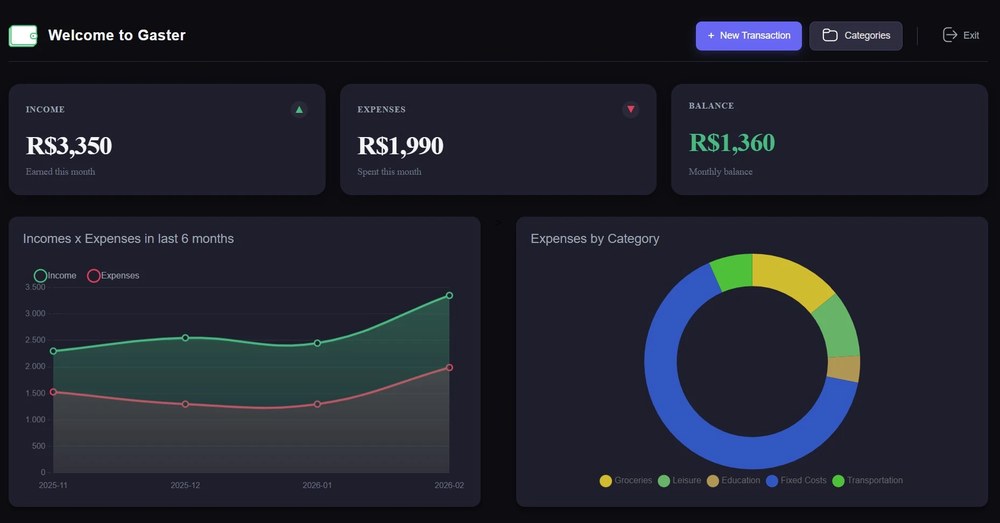

# 💰 Gaster - Personal Finance Tracker

A straightforward fullstack application for tracking personal expenses and income. Built with a focus on simplicity and solid architecture.



---

## 🛠️ Tech Stack

**Backend (API):**
- Node.js + Express
- PostgreSQL (Database)
- Knex.js (Query Builder & Migrations)
- Docker (DB containerization)
- JWT (Authentication)

**Frontend (Web):**
- Angular (v15+)
- RxJS
- CSS

**Infrastructure:**
- AWS EC2 (Backend hosting)
- Vercel (Frontend hosting)

---

## ⚙️ How to Run Locally

### Prerequisites
- Node.js and npm installed.
- Docker installed and running.

### 1. Clone the repository
```bash
git clone [https://github.com/kauanrakoski/gaster.git](https://github.com/kauanrakoski/gaster.git)
cd gaster